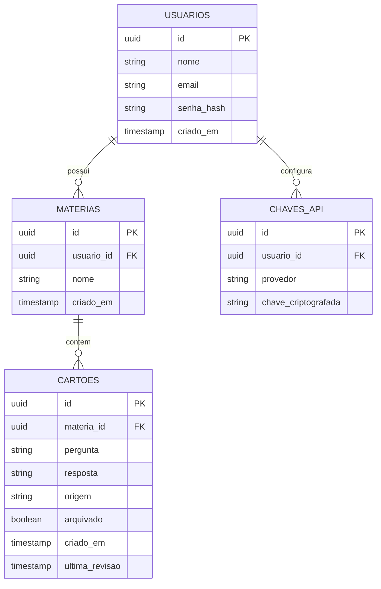

# Modelo de dados

## Diagrama entidade-relacionamento

## Entidades

### Usuario
| Campo | Tipo | Notas |
|---|---|---|
| id | uuid | PK |
| nome | string | |
| email | string | único |
| senha_hash | string | nunca armazenar senha em texto puro |
| criado_em | timestamp | |

### Materia
| Campo | Tipo | Notas |
|---|---|---|
| id | uuid | PK |
| usuario_id | uuid | FK → Usuario. Toda matéria pertence a exatamente um usuário |
| nome | string | |
| criado_em | timestamp | |

Sem limite de quantidade de matérias por usuário (diferente do protótipo original, que tinha
`MAX_MATERIAS = 5` por limitação de canvas).

### Cartao
| Campo | Tipo | Notas |
|---|---|---|
| id | uuid | PK |
| materia_id | uuid | FK → Materia |
| pergunta | text | |
| resposta | text | |
| origem | string | `manual` ou `ia`. Usar `CHECK` constraint, não enum nativo do Postgres (mais fácil de evoluir sem `ALTER TYPE`) |
| arquivado | boolean | default `false`. Substitui qualquer modelo de "estado de memória" — é a única flag de progresso do cartão |
| criado_em | timestamp | |
| ultima_revisao | timestamp | nullable. Só um registro informativo de "visto pela última vez em", nunca usado para calcular prazos |

**Importante:** este modelo passou por duas iterações antes de chegar aqui — uma versão inicial
cogitou um algoritmo de repetição espaçada estilo SM-2 (campos `intervalo`, `fatorFacilidade`,
`proximaRevisao`), e uma segunda cogitou um enum de estado (`aprendendo`/`fixado`) atribuído após
cada revisão. As duas foram descartadas em favor do campo único `arquivado`, que é setado apenas
via edição deliberada do cartão, nunca durante a sessão de estudo. **Não reintroduzir essas
lógicas sem alinhar antes** — é uma decisão de produto, não uma limitação técnica.

### ChaveApi
| Campo | Tipo | Notas |
|---|---|---|
| id | uuid | PK |
| usuario_id | uuid | FK → Usuario |
| provedor | string | ex: `anthropic`, `groq` |
| chave_criptografada | string | nunca armazenar em texto puro; criptografar antes de persistir |

Suporta o padrão BYOK (bring your own key) descrito em `04-arquitetura-tecnica.md`: um usuário
pode ter zero, uma ou várias chaves configuradas, uma por provedor.

## Migrações

Recomendado usar **Flyway** (ou equivalente) com migrations versionadas em vez de deixar o
Hibernate gerar/alterar o schema automaticamente (`ddl-auto: update`) além da fase de
prototipagem local.
